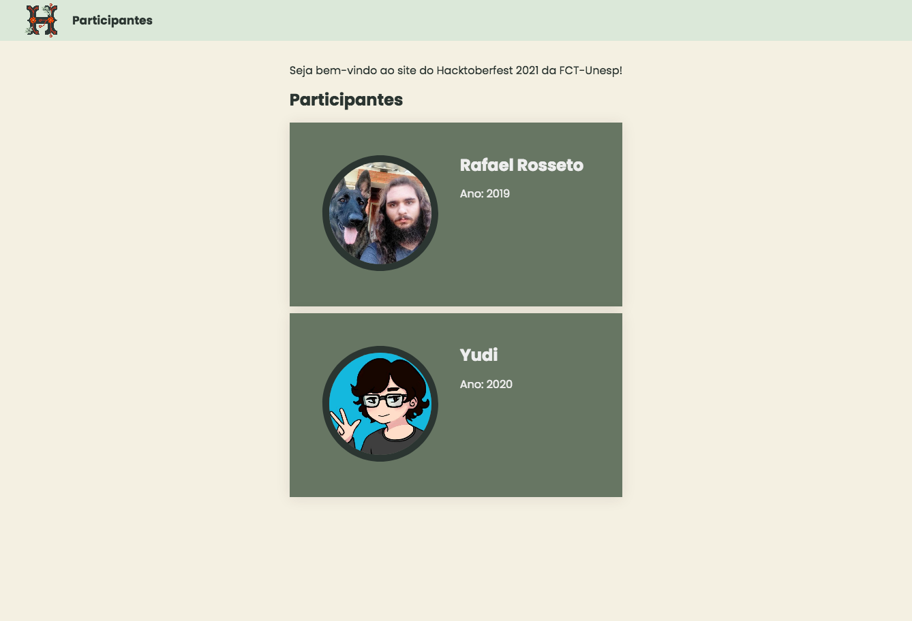

# Presenças do Hacktoberfest 2021

Esse repositório (repo) contém o código fonte para o livro de presenças do Hacktoberfest 2021, disponível em [http://fct-hacktober-2021.surge.sh/](http://fct-hacktober-2021.surge.sh/).

## Contribuições

Pull requests são bem-vindas! Por favor, [crie uma issue](https://github.com/fct-coders/hacktoberfest-2021-presencas/issues/new/choose) para discorrer sobre a mudança antes de realizá-la.  
Lembre-se de ler o [guia de contribuição](CONTRIBUTING.md) (contributing guidelines) e o nosso [código de conduta](CODE_OF_CONDUCT.md) (code of conduct).

## Licença

Esse projeto segue a licença [MIT](https://choosealicense.com/licenses/mit/).
